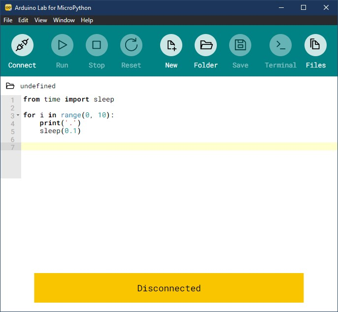
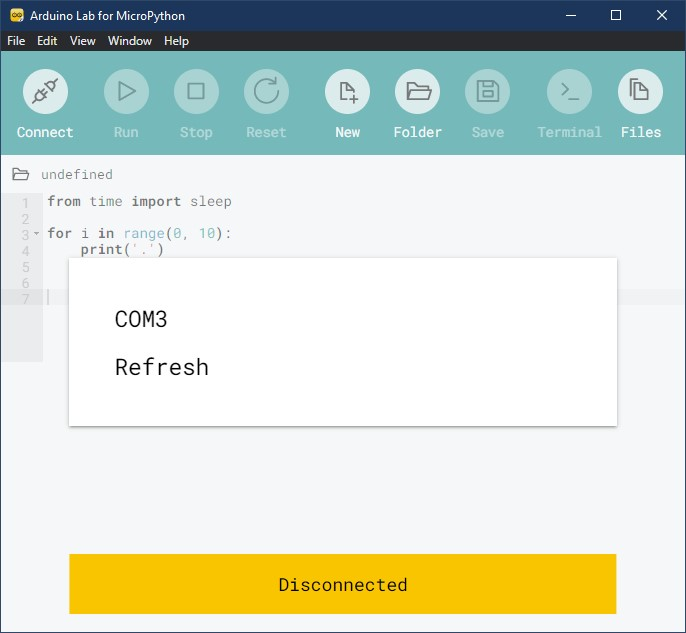
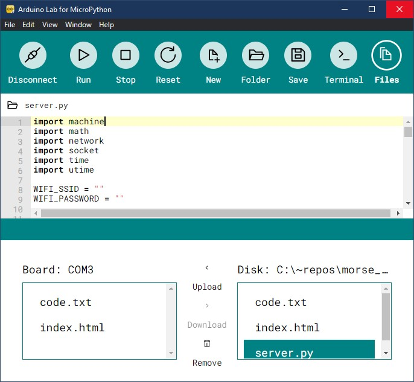
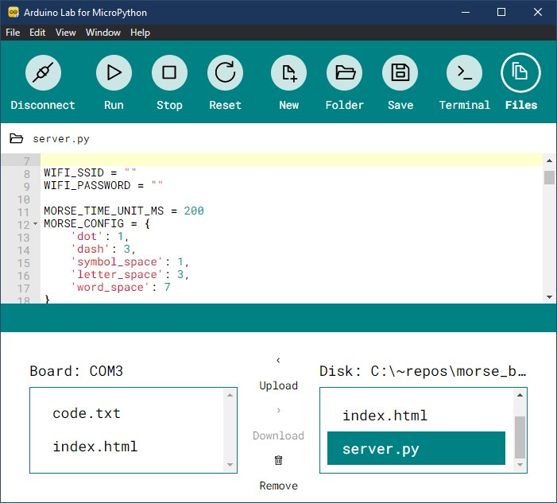
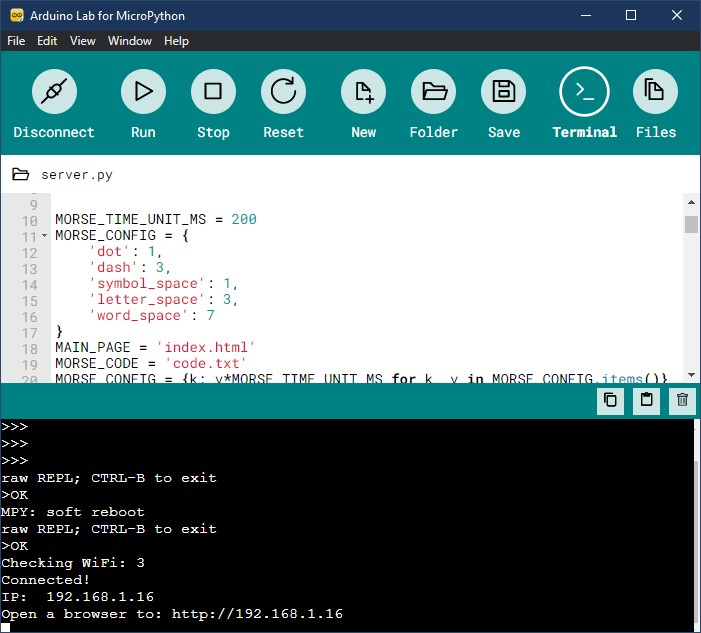
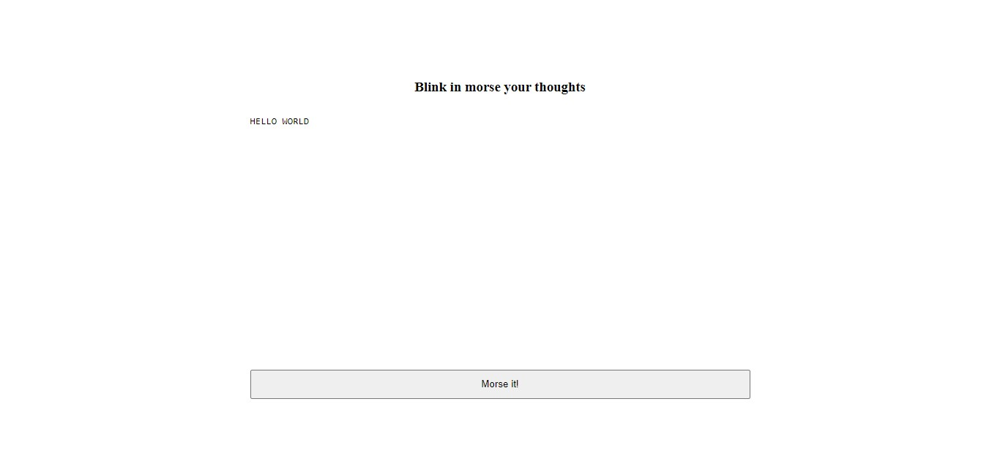
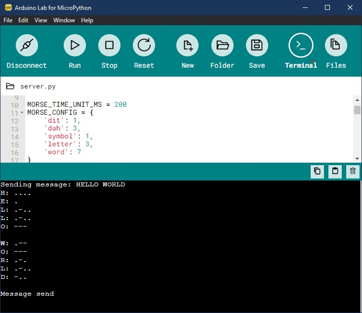

# Blink Raspberry Pico with Morse code
A MicroPython implementation for transmitting Morse code messages with build-in LED
for Raspberry Pico W.

Based on the International Morse Code

[Rhey T. Snodgrass &amp; Victor F. Camp, 1922](https://commons.wikimedia.org/wiki/File:International_Morse_Code.svg), Public domain, via Wikimedia Commons

## Required Equipment
- [Raspberry Pico W](https://www.raspberrypi.com/documentation/microcontrollers/rp2040.html#raspberry-pi-pico-w)
- A WiFi connection available with known credentials

## Usage
- Flash Raspberry Pico with [MicroPython uf2 firmware](https://micropython.org/download/rp2-pico-w/)
- Download and run [Arduino Lab for MicroPython](https://labs.arduino.cc/en/labs/micropython)

- Connect Raspberry Pico W with USB and Connect to its port

- Click Folder and open src/ folder inside the project
- Files view opens in which you can upload code.txt and index.html

- Select server.py so its code loads into the editor

- Edit WIFI_SSID and WIFI_PASSWORD with your WiFi credentials
  MORSE_TIME_UNIT_MS = 200 is the duration of the base time unit
  used in MORSE_CONFIG as integer multiples for each operation
- Click Run and notice the connection status as reported in the terminal until it reaches status: 3

- Open the http URL as reported in the terminal in your browser

  Enter your message and click "Morse it!" button

- A POST request is send to Pico's http server and the message starts to blink

Nice right :)
